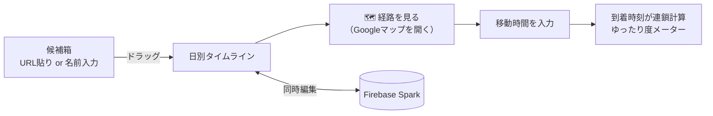

# trip-planner コンセプト（2026-09-17 決定）

my-workspace でのアイディア出しで固まった内容。`/build-app` はここを出発点にする。

## 一言で

**移動時間が見える、2人用のふせん式しおり。**
行き先と宿は決まっている前提。「どの順番で回るか」を夫婦2人で気軽に並べ替え、到着時刻と「ゆったり度」が自動で出る。

## 絶対条件

| # | 条件 | 理由 |
|---|---|---|
| 1 | **完全無料。カード登録・APIキー不要** | 「知らぬ間に課金」を構造的にゼロにする |
| 2 | **入力はめっちゃ簡単。複雑さゼロ** | 妻も使う。説明なしで使えること |
| 3 | 頼まれていない機能を足さない | MVP を小さく保つ |

## 決めたこと（経緯）

| 検討した案 | 結論 |
|---|---|
| Google Maps API を使う | ❌ カード登録必須。上限超過時の自動停止機能も標準では無い |
| OpenStreetMap 系 API（OSRM 等） | ❌ 電車の移動時間が出ない。今回は見送り（車旅なら将来の選択肢） |
| **③ API なし「計画ボード」型** | ✅ 採用。地図・経路は Googleマップ本体をリンクで開き、アプリは計画・記録・可視化に専念 |

## 「簡単さ」の具体ルール

- **入れるのは「滞在時間」と「移動時間」の 2 つだけ**。時刻はすべて自動計算
- 場所の追加は「Googleマップの共有 URL を貼る」か「名前を打つ」だけ
- 滞在時間・移動時間は **チップ選択**（15 / 30 / 45 / 60 / 90 / 120 分）。細かい数字は任意
- 移動時間は「🗺️ 経路を見る」ボタンで Googleマップ（出発地→目的地・移動手段入り）が開き、戻ると入力欄が待っている
- **ログイン画面なし**。旅行ごとの URL（＋合言葉）を妻に送れば共同編集できる
- 設定画面なし。主要操作は 3 タップ以内

## MVP（最初に作る範囲）

1. 候補箱（場所を溜める）
2. 日別タイムライン（ドラッグで並べ替え）
3. 滞在時間・移動時間の入力（チップ）→ 到着時刻の自動計算
4. 「経路を見る」ボタン（Googleマップの URL に出発地・目的地・移動手段を埋め込む。API ではなく普通のリンク）
5. 日ごとの「ゆったり度」メーター
6. 2 人での同時編集（Firebase Realtime Database or Firestore、Spark プラン）

## ゆったり度の定義（初期案・調整可）

| 指標 | 計算 |
|---|---|
| 滞在合計 | 各場所の滞在時間の合計 |
| 移動合計 | 各区間の移動時間の合計 |
| 余白 | 1 日の活動時間（例：9:00〜21:00）− 滞在合計 − 移動合計 |
| 判定 | 🛋️ ゆったり：移動が全体の 3 割以下かつ余白あり / 🚶 ちょうどいい / 🏃 詰め込みすぎ：移動が 5 割超 または 余白なし |

見せ方：日ごとの帯グラフ（滞在＝色つき、移動＝グレー、余白＝白）＋ 3 段階の絵文字。
場所ごとに「移動 > 滞在」なら注意マーク。

## タイムラインの例

| 時刻 | 場所 | 滞在 | →次への移動 |
|---|---|---|---|
| 09:00 | 宿を出発 | ー | 🚗 40分 |
| 09:40 | 〇〇神社 | 60分 | 🚶 15分 |
| 10:55 | カフェ△△ | 45分 | 🚗 30分 |
| 12:10 | ランチ □□ | 75分 | 🚗 50分 |
| 14:15 | ◇◇美術館 | 90分 | 🚗 35分 |
| 16:20 | 宿にチェックイン（📌固定 15:00〜） | | ✅ 間に合う |

## MVP の後で足す候補（順不同・頼まれたら）

| 機能 | ひとことで |
|---|---|
| 🗳️ いいね | 2 人がそれぞれ押せる。両方押した候補が上に浮く |
| 📌 固定枠 | 「チェックイン 15 時」「夕食 18 時」を先に置き、間に合うか色で判定 |
| 🌧️ 屋内/屋外タグ | 雨予報の日に屋外候補をグレー表示 |
| ✅ 当日モード | 到着・出発をボタン 1 つで打刻。実際の滞在・移動時間を記録 |
| 📝 記録 | 場所ごとにメモ・よかった度 5 段階・写真 URL（写真本体は保存しない） |
| 📊 振り返り | 予定 vs 実際、移動合計、2 人の評価一致率 |
| 📖 しおり書き出し | 印刷・PDF 保存用の 1 ページ |

## 技術（無料・カード不要で組む）

| 役割 | 使うもの | 費用 | 備考 |
|---|---|---|---|
| フロント | 静的 Web アプリ（スマホ優先） | 0 円 | フレームワークは `/build-app` 冒頭で決定 |
| 同時編集・保存 | Firebase Sparkプラン | 0 円・カード不要 | 請求先が存在しないので課金不可能 |
| 公開 URL | Firebase Hosting（Spark） | 0 円 | ⚠️ GitHub Pages は private リポ × Free プランで不可の可能性 |
| 地図・経路 | Googleマップ本体（リンクで開く） | 0 円 | `https://www.google.com/maps/dir/?api=1&origin=...&destination=...&travelmode=transit` の形式。API キー不要 |

## 未決事項（`/build-app` で決める）

- フレームワーク（Vite + React か、素の HTML/JS か）
- Firebase の Realtime Database と Firestore のどちらを使うか
- 「合言葉」方式の具体的な実装（匿名認証＋旅行 ID など）
- 1 日の活動時間の初期値（9:00〜21:00 で仮置き）
